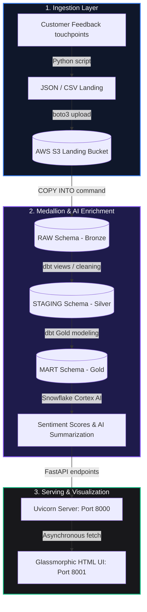

# 📊 Intelligent Customer Feedback & Sentiment Engine

An enterprise-grade, 7-phase **Customer Feedback & Sentiment Analytics Engine** powered by a dbt Snowflake Medallion architecture, AWS S3 storage, Snowflake Cortex AI, a FastAPI serving layer, and a stunning glassmorphic dashboard.

---

## 🏗️ Architectural Overview & Flow

The system processes unstructured customer feedback channels (Web surveys, App Store, Support tickets) through an automated ELT pipeline:



---

## 📁 Repository Structure

```text
customer-sentiment-engine/
├── .env                              # Active credentials (git-ignored)
├── .env.template                     # Template environment file
├── .gitignore                        # Standard git ignore patterns
├── README.md                         # This comprehensive developer manual
├── requirements.txt                  # Python dependencies
├── run_pipeline.ps1                  # PowerShell full orchestrator runner
├── run_pipeline.sh                   # Unix full orchestrator runner
├── run_pipeline.bat                  # Windows batch orchestrator runner
├── run_dbt.ps1                       # Helper script to run dbt tasks
├── data/
│   └── raw/                          # Local directory for generated JSON logs
├── dbt/                              # dbt (Data Build Tool) project configurations
│   ├── dbt_project.yml
│   ├── profiles.yml                  # Snowflake profiles
│   ├── macros/
│   │   └── generate_schema_name.sql # Custom schema prefix overrides
│   └── models/
│       ├── staging/
│       │   └── stg_customer_feedback.sql
│       └── marts/
│           └── fct_customer_feedback.sql
├── frontend/
│   └── index.html                    # Glassmorphic analytics dashboard UI
├── scripts/
│   ├── api_server.py                 # FastAPI backend server
│   ├── ingest_feedback.py            # Local JSON generator & S3 uploader
│   └── load_raw_data.py              # Snowflake Bronze stage landing loader
└── sql/
    └── snowflake_setup.sql           # Snowflake DDL (Schemas, Roles, Stages)
```

---

## 🛠️ Step-by-Step Installation & Setup

### 1. Clone & Set Up the Environment
First, ensure you have Python 3.9+ installed. Navigate to the project directory and install the requirements:
```bash
pip install -r requirements.txt
```

### 2. Configure Environment Variables
Copy `.env.template` to `.env` and fill in your absolute Snowflake and AWS target details:
```bash
cp .env.template .env
```
Ensure your `.env` contains valid AWS and Snowflake access credentials:
```ini
AWS_ACCESS_KEY_ID=your_aws_key
AWS_SECRET_ACCESS_KEY=your_aws_secret
AWS_REGION=us-east-1
S3_RAW_BUCKET_NAME=customer-feedback-raw-landing-bucket

SNOWFLAKE_ACCOUNT=your_snowflake_locator
SNOWFLAKE_USER=your_snowflake_username
SNOWFLAKE_PASSWORD=your_snowflake_password
SNOWFLAKE_ROLE=ACCOUNTADMIN
SNOWFLAKE_WAREHOUSE=test
SNOWFLAKE_DATABASE=CUSTOMER_FEEDBACK_DB
SNOWFLAKE_SCHEMA=MART
```

---

## ⚡ Running the Pipeline (End-to-End)

You can run the entire pipeline (Ingestion to dbt transformations) in a single command, or execute each step independently.

### Option A: Run Using the Orchestrator Scripts
To execute ingestion, load Snowflake RAW, compile dbt models, and test data Integrity:
* **Windows (PowerShell):**
  ```powershell
  ./run_pipeline.ps1
  ```
* **macOS / Linux:**
  ```bash
  chmod +x run_pipeline.sh
  ./run_pipeline.sh
  ```

---

### Option B: Step-by-Step Manual Execution

#### Step A: Generate & Stream Feedback Data to S3
This script generates mock reviews from Web, Survey, and Support channels, saving them locally and uploading them to AWS S3:
```bash
python scripts/ingest_feedback.py
```

#### Step B: Load Raw Data into Snowflake (Bronze)
This executes the `COPY INTO` command to load raw variant JSON records from the S3 stage directly into Snowflake `RAW.CUSTOMER_FEEDBACK`:
```bash
python scripts/load_raw_data.py
```

#### Step C: Execute dbt Transformations & AI Scoring (Silver & Gold)
Execute the Silver casting and Gold analytics models. During this step, Snowflake parses JSON metrics and generates Cortex AI Sentiment scores:
```bash
cd dbt
dbt run --profiles-dir .
dbt test --profiles-dir .
```

---

## 🖥️ Launching the Application UI & API

To view the premium glassmorphic analytics dashboard, **both the FastAPI backend and the frontend server must be running concurrently.** The frontend webpage acts as a client that fetches live statistics from the backend server.

### 1. Launch the FastAPI Backend
Start the backend ASGI API server using Uvicorn:
```bash
python -m uvicorn scripts.api_server:app --reload --port 8000
```
* **API Address:** `http://127.0.0.1:8000`
* **Swagger Documentation:** `http://127.0.0.1:8000/docs` (View interactive endpoints in real-time)

### 2. Launch the Frontend UI Dashboard
With the FastAPI backend running, open a **separate terminal window** to start the frontend service:

```bash
cd frontend
python -m http.server 8001
```
* **Dashboard URL:** Open **[http://localhost:8001](http://localhost:8001)** in your web browser.
* *Alternative:* You can simply double-click and open the [index.html](frontend/index.html) file directly in Google Chrome, Microsoft Edge, or Firefox.

### ❓ How the HTML UI and FastAPI Interact
* **Separate Running Services:** Yes, they must run together. The HTML page contains JavaScript code (`index.html`) that queries `http://127.0.0.1:8000/api/metrics` and `http://127.0.0.1:8000/api/feedback` to dynamically retrieve real-time Snowflake KPI data.
* **If the FastAPI server is stopped:** The dashboard will render a premium connection loss screen and prompt you to run the Uvicorn command to restore the active state.
